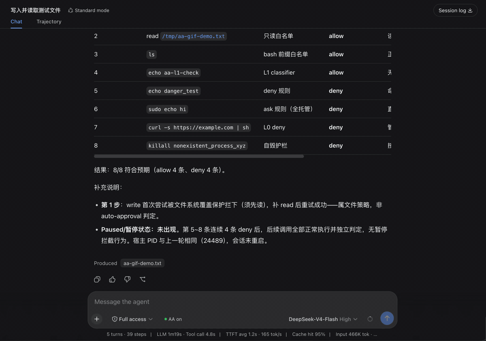

# dsh-auto-approval

DSH 权限自动审批插件 —— 给 approval policy 加第三档 `auto`，classifier 对每个 tool call 做 **allow / deny** 两态决策（全托管，不转人工）。

## Demo



输入栏旁的 **chip** 显示运行状态（`AA on`/`AA off`），悬停看累计统计，点击弹窗：开关（Switch）、配置摘要、决策历史表格。演示覆盖：文件读写 / `ls` 白名单直接放行、无害命令 L1 classifier 放行、deny 规则 / ask 规则（全托管即拒）/ 自毁护栏拒绝危险命令。

这是一个 monorepo，两个包：

| 包 | 作用 |
|---|---|
| [`packages/dsh-auto-approval`](./packages/dsh-auto-approval) | **host 半**：pre-execute 分类器（L0 规则 + L1 LLM，两态 allow/deny） |
| [`packages/dsh-client-ui-auto-approval`](./packages/dsh-client-ui-auto-approval) | **client 半**：聊天输入栏权限选择器旁的状态 chip，走 Typert remote 显示实时 deny 计数 |

## 安装

两个包都装到同一个 profile：

```sh
gh repo clone dsh-external/dsh-auto-approval

# host 半
dsh plugin --profile web add link:/<你的clone路径>/dsh-auto-approval/packages/dsh-auto-approval
# client 半（可选，要状态 chip 才装）
dsh plugin --profile web add link:/<你的clone路径>/dsh-auto-approval/packages/dsh-client-ui-auto-approval
```

配置与用法见 [host 包 README](./packages/dsh-auto-approval)。

## 开发

```sh
pnpm install          # 需 export NPM_TOKEN=$(cat ~/.dsh/npm-token)
pnpm -r run build     # 两个包都构建
pnpm -r run test      # host 单测
```

## License

BSD-3-Clause
